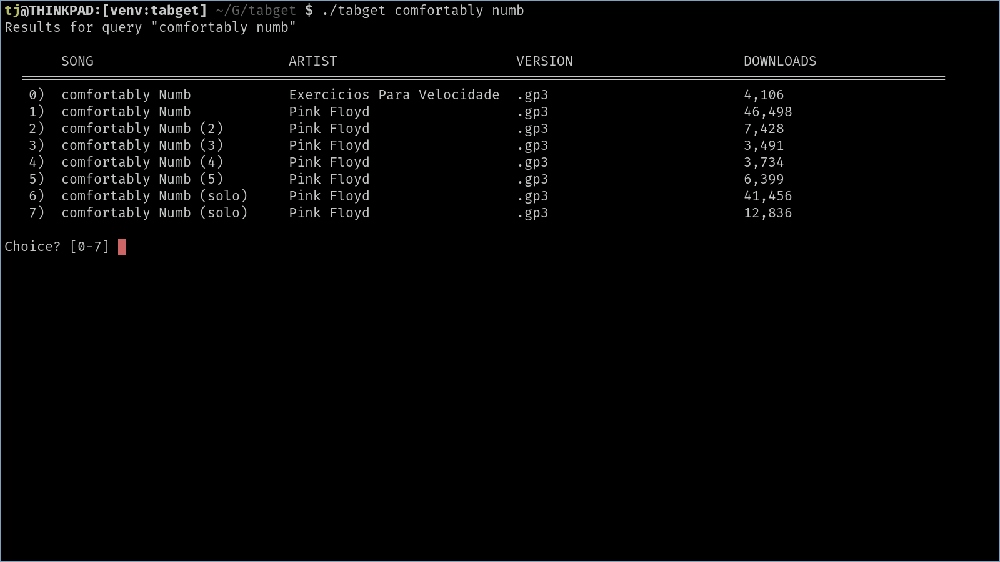

# tabget
Search for .gpX (GuitarPro tablature) files from the terminal

## Install

1) install requirements with `pip`
2) copy `tabget` anywhere in your `$PATH`.

### TODO

- programmatic retrieval of .gpX files (if possible from specified source)
  - open files directly in GuitarPro / TuxGuitar
- scrape from additional source websites
  - cache queries, not webpage contents
  - multi-thread downloads
- sort parameters (eg. sort by number of downloads/only version X)
- arg handling
  - make copy to clipboard optional
  - option to auto-select most downloaded?

### DONE
- scrape / search guitarprotabs.com
- cache query results
- copy link to clipboard
